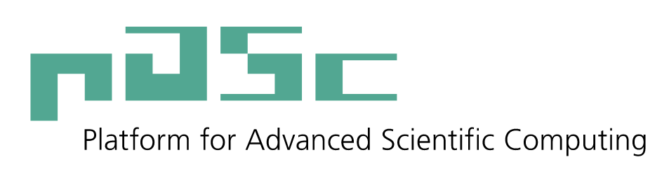

[DLA-Future-Fortran] is a [Fortran] interface for [DLA-Future], a task-based linear algebra library providing GPU-enabled distributed eigensolver. [DLA-Future] is based on the [pika] library for concurrency and parallelism, and supports both [Nvidia] and [AMD] GPUs.

## Usage

### Initialization and finalization

Before calling any [DLA-Future] routine, the library (and the underlying [pika] runtime) need to be initialized:

```Fortran
call dlaf_initialize()
```

[DLA-Future] should be finalized when it is no longer needed:

```Fortran
call dlaf_finalize()
```

## Grid initialization 

[DLA-Future] needs to know how a matrix is distributed. A [DLA-Future] grid can be created directly on top of a [BLACS] grid, using the corresponding [BLACS] context:

```Fortran
! blacs_context is an existing BLACS context
call dlaf_create_grid_from_blacs(blacs_context)
```

When a grid is no longer needed, it can be freed:

```Fortran
! blacs_context is an existing BLACS context
call dlaf_free_grid(blacs_context)
```

### ScaLAPACK drop-in

[DLA-Future-Fortran] can be used as a [ScaLAPACK] drop-in. [DLA-Future] takes a subset of [ScaLAPACK] arguments. For example, workspaces are managed internally in [DLA-Future].

#### Example: Hermitian generalized eigensolver

The following is an example of how a code using [ScaLAPACK]'s hermitian generalized eigensolver can be adapted to use [DLA-Future] instead:

```diff
 call mpi_init_thread(...)
+call dlaf_initialize()
 call blacs_get(0, 0, blacs_context)
 call blacs_gridinit(blacs_context, ...)
+call dlaf_create_grid_from_blacs(blacs_context)

 ! ...

-! Workspaces setup (work, rwork, iwork)

-call pzheevd('V', 'L', n, a, 1, 1, desca, w, z, 1, 1, descz, work, lwork, rwork, lrwork, iwork, liwork, info)
+call call dlaf_pzheevd('L', n, a, 1, 1, desca, w, z, 1, 1, descz, info)

-! Workspaces cleanup (work, rwork, iwork)
 
 ! ...

+call dlaf_free_grid(blacs_context)
 call blacs_gridexit(blacs_context)
+call dlaf_finalize()
 call mpi_finalize(...)
```


## Acknowledgements

The development of [DLA-Future-Fortran] is supported by the following organizations:

* [CSCS]: Swiss National Supercomputing Center
* [ETH Zurich]: Swiss Federal Institute of Technology Zurich
* [PASC]: Platform for Advanced Scientific Computing



[AMD]: https://www.amd.com/en.html
[BLACS]: https://www.netlib.org/blacs/
[CSCS]: https://www.cscs.ch
[DLA-Future-Fortran]: https://github.com/eth-cscs/DLA-Future-Fortran
[DLA-Future]: https://github.com/eth-cscs/DLA-Future
[ETH Zurich]: https://ethz.ch/en.html
[Fortran]: https://github.com/eth-cscs/DLA-Future
[Nvidia]: https://www.nvidia.com/en-us/
[PASC]: https://www.pasc-ch.org/
[pika]: https://github.com/pika-org/pika
[ScaLAPACK]: https://www.netlib.org/scalapack/
