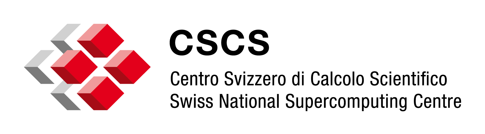

# DLA-Future Fortran Interface

 [](https://doi.org/10.5281/zenodo.11241331) [](https://gitlab.com/cscs-ci/ci-testing/webhook-ci/mirrors/657496524998283/7598378243915359/-/commits/main)

Fortran interface for [DLA-Future], a task-based linear algebra library providing GPU-enabled distributed eigensolver.

## Fortran API

The [DLA-Future] Fortran API provides the following functionality:

* [DLA-Future] and [pika] initialization/finalization: `dlaf_initialize`/`dlaf_finalize`
* Distributed grid creation/destruction: `dlaf_create_grid_from_blacs`/`dlaf_free_grid`
* Cholesky decomposition: `dlaf_pXpotrf` (`X=s,d,c,z`)
* Eigensolver for symmetric matrices: `dlaf_pXsyevd` (`X=s,d`)
* Eigensolver for hermitian matrices: `dlaf_pXheevd` (`X=c,z`)
* Generalised eigensolver for symmetric matrices: `dlaf_pXsygvx` (`X=s,d`)
* Generalised eigensolver for hermitian matrices: `dlaf_pXhegvx` (`X=c,z`)

## ScaLAPACK Drop-In

The Fortran API (as well as the ScaLAPACK-like C API) is designed as drop-in replacement for ScaLAPACK.

If you have a ScaLAPACK call in your code 
```fortran
call pzheevd(&
    'V', 'L', n, &
    a, 1, 1, desca, &
    w, z, 1, 1, descz, &
    work, lwork, rwork, lrwork, iwork, liwork, info &
)
```
you can easily use DLA-Future as a drop-in replacement as follows (given a BLACS context `ictxt`):
```fortran
call dlaf_initialize()
call dlaf_create_grid_from_blacs(ictxt)
! ...
call dlaf_pzheevd(&
    'L', n, &
    a, 1, 1, desca, &
    w, z, 1, 1, descz, &
    info &
)
! ...
call dlaf_free_grid(ictxt)
call dlaf_finalize()
```


## Acknowledgements

The development of [DLA-Future-Fortran] is supported by the following organizations:

* [CSCS]: Swiss National Supercomputing Center
* [ETH Zurich]: Swiss Federal Institute of Technology Zurich
* [PASC]: Platform for Advanced Scientific Computing



[DLA-Future]: https://github.com/eth-cscs/DLA-Future
[pika]: https://pikacpp.org/
[DLA-Future-Fortran]: https://github.com/eth-cscs/DLA-Future-Fortran
[CSCS]: https://www.cscs.ch
[ETH Zurich]: https://ethz.ch/en.html
[PASC]: https://www.pasc-ch.org/
